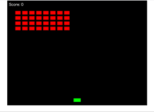

# Python Space Invaders (PyScript)

## 📌 概要

本プロジェクトは **Python + PyScript** を使用してブラウザで動作する **Space Invaders（インベーダーゲーム）** を再現したものです。  
FastAPIを用いたサーバサイドと、PyScriptによるフロントエンドの組み合わせで実装されています。  
ゲームはブラウザ上で動作し、プレイヤーは矢印キーで移動、スペースキーで弾を発射して敵を倒します。
簡単にすべての敵を倒せるのでストレスなく遊べます。



---

## 🎮 **ゲームのルール**

- 画面上部に配置された **インベーダー（敵）** を撃って倒していくゲームです。
- 矢印キー（← →）で **プレイヤーの宇宙船を移動** できます。
- スペースキー（`SPACE`）で **弾を発射** できます（連射可能）。
- 敵は **左右に移動し、端に到達すると下降** します。
- **敵がすべて消滅するとゲームクリア** となり、スペースキーでリスタートできます。

---

## 📦 **環境構築**

### **🔧 必要なツール**

- Python 3.10 以上
- FastAPI（バックエンド）
- Uvicorn（FastAPI の ASGI サーバ）
- PyScript（ブラウザ上でPythonを実行するためのライブラリ）

### **1️⃣ プロジェクトのクローン**

```bash
git clone https://github.com/okamyuji/space-invaders-pyscript.git
cd space-invaders-pyscript
```

### **2️⃣ 仮想環境の作成**

```bash
python -m venv venv
source venv/bin/activate
```

### **3️⃣ 仮想環境の有効化**

- Windows

```bash
venv\Scripts\activate
```

- macOS / Linux

```bash
source venv/bin/activate
```

### **4️⃣ 依存ライブラリのインストール**

```bash
pip install fastapi uvicorn
```

### **5️⃣ サーバの起動**

- FastAPIを使用してWebサーバを起動します。

```bash
uvicorn main:app --reload
```

### **6️⃣ ブラウザでゲームをプレイ**

- ブラウザを起動し、`http://localhost:8000` にアクセスしてゲームをプレイします。

### **7️⃣ 🕹 操作方法**

- 矢印キー（← →）で **プレイヤーの宇宙船を移動** できます。
- スペースキー（`SPACE`）で **弾を発射** できます（連射可能）。
- 敵は **左右に移動し、端に到達すると下降** します。
- **敵がすべて消滅するとゲームクリア** となり、スペースキーでリスタートできます。

### **8️⃣ 📂 ディレクトリ構成**

space-invaders-pyscript/
│── main.py                # FastAPIサーバ
│── .gitignore             # Gitで無視するファイル一覧
│── README.md              # プロジェクト説明
│
├── templates/
│   └── index.html         # フロントエンドのHTMLファイル
│
├── static/
│   └── game.py            # PyScriptによるゲームロジック
│
├── venv/                  # 仮想環境（.gitignore推奨）

## **9️⃣ 🏗 アーキテクチャ構成**

本プロジェクトは、FastAPIを使用したバックエンドとPyScriptによるフロントエンドの組み合わせで構成されています。Pythonのみを使用しつつ、ブラウザ上で実行可能なシューティングゲームを実現しています。

### 🛠 使用技術

| コンポーネント | 技術 |
| -------------- | -------------- |
| バックエンド | FastAPI + Uvicorn |
| フロントエンド | HTML + CSS + PyScript |
| ゲームロジック | PyScript (Python on Browser) |
| 通信方式 | FastAPI による静的ファイル提供 |

### 🔹 アーキテクチャ概要

本プロジェクトはサーバ + クライアント一体型のシンプルな設計となっています。

1. FastAPIサーバ

    - / にアクセスするとindex.htmlを提供する。
    - /static/ 配下にPyScriptのゲームロジックgame.pyを配置し、ブラウザ側で読み込む。

2. フロントエンド（PyScript）

    - index.html内でgame.pyをpy-scriptタグを使用して読み込む。
    - game.py内でキャンバス (canvas) を操作し、ゲームを描画。

3. ゲームループ

    - asyncio による非同期ループを利用して、60FPS（毎フレーム 1/60秒）で更新・描画 を実行。
    - キー入力処理（左右移動、弾発射）と、敵の動作（移動・降下）を管理。

### 🔹 ゲームの実装ロジック

このゲームは以下の4つの主要ロジックで構成されています。

#### 1️⃣ プレイヤーの操作

- ◀ / ▶ を押すと プレイヤーの宇宙船が左右に移動する。
- 画面端に到達した場合は、それ以上動かないよう制限する。

#### 2️⃣ 弾の発射 & 連射制御

- SPACEを押すと、弾が発射される。
- 連射を防ぐため、一定のクールダウン (fire_cooldown) を設定。
- 弾は 毎フレーム上方向に移動し、画面外に出ると消滅。

#### 3️⃣ 敵（インベーダー）の移動

- 敵は左右に移動し、画面端に到達すると一段下降する。
- 敵の一番下の位置に応じて、移動速度を加速（ゲーム後半ほど難易度が上昇）。
- 全ての敵が倒されるとゲームクリアとなる。

#### 4️⃣ 衝突判定 & スコア管理

- 弾が敵に当たった場合
    - 該当する敵を削除し、スコアを加算。
    - 弾も削除される。
- 全ての敵が倒された場合
    - game_over = Trueに設定し、"GAME OVER"を画面中央に表示。
    - SPACEキーを押すとゲームをリスタート。

### 🔹 ゲームのアルゴリズム詳細

以下にゲームのアルゴリズム設計を詳しく解説する。

#### 1️⃣ プレイヤーの移動処理

```python
def update_game():
    if keys.get("ArrowLeft"):
        spaceship["x"] -= spaceship["speed"]
    if keys.get("ArrowRight"):
        spaceship["x"] += spaceship["speed"]

    # 画面端を超えないように制限
    spaceship["x"] = max(0, min(spaceship["x"], WIDTH - spaceship["width"]))
```

- **解説**
    - keysはkeydownイベントを取得し、押されているキーを記録する辞書。
    - ◀ / ▶ が押された場合、一定速度で左右移動 する。
    - max(0, min(...)) により、画面端を超えないよう制限 する。

#### 2️⃣ 弾の発射 & クールダウン制御

```python
def fire_bullet():
    global fire_cooldown
    if fire_cooldown <= 0:
        bullet = {
            "x": spaceship["x"] + spaceship["width"] // 2 - 2,
            "y": spaceship["y"],
            "width": 4,
            "height": 10,
            "speed": 7
        }
        bullets.append(bullet)
        fire_cooldown = 12  # クールダウン時間（12フレーム = 0.2秒）
```

- **解説**
    - fire_cooldownによる制限を設け、短時間での連射を防ぐ。
    - クールダウンが0以下の場合のみ弾を発射し、クールダウンを12フレームに設定。

#### 3️⃣ 敵（インベーダー）の移動 & 降下

```python
def update_game():
    global alien_direction, alien_speed

    move_down = False
    alien_speed = get_alien_speed()  # 速度を動的に更新

    for alien in aliens:
        alien["x"] += alien_speed * alien_direction
        if alien["x"] < 0 or alien["x"] + alien["width"] > WIDTH:
            move_down = True

    if move_down:
        alien_direction *= -1
        for alien in aliens:
            alien["y"] += 10
```

- **解説**
    - alien_speedの速さで左右移動し、画面端に到達するとmove_down = Trueに。
    - move_downがTrueなら方向を反転し、一段下に移動。

#### 4️⃣ 衝突判定 & スコア管理

```python
for bullet in bullets[:]:
    for alien in aliens[:]:
        if (bullet["x"] < alien["x"] + alien["width"] and
            bullet["x"] + bullet["width"] > alien["x"] and
            bullet["y"] < alien["y"] + alien["height"] and
            bullet["y"] + bullet["height"] > alien["y"]):
            try:
                aliens.remove(alien)
                bullets.remove(bullet)
                score += 100  # スコア加算
            except ValueError:
                pass
            break
```

- **解説**
    - 各弾と各敵の座標を比較し、衝突判定を実施。
    - ヒット時には敵と弾を削除し、スコアを加算。

#### 🔹 まとめ

本ゲームは以下の4つの主要ロジックで構築されている

- プレイヤーの移動
- 弾の発射 & クールダウン
- 敵の移動 & 降下
- 衝突判定 & スコア管理

この設計により、シンプルながら クラシックなSpace Invadersの挙動を忠実に再現 している。

## **9️⃣ 📝 ライセンス**

このプロジェクトはMITライセンスで提供されています。詳細については [LICENSE](LICENSE) ファイルを参照してください。
